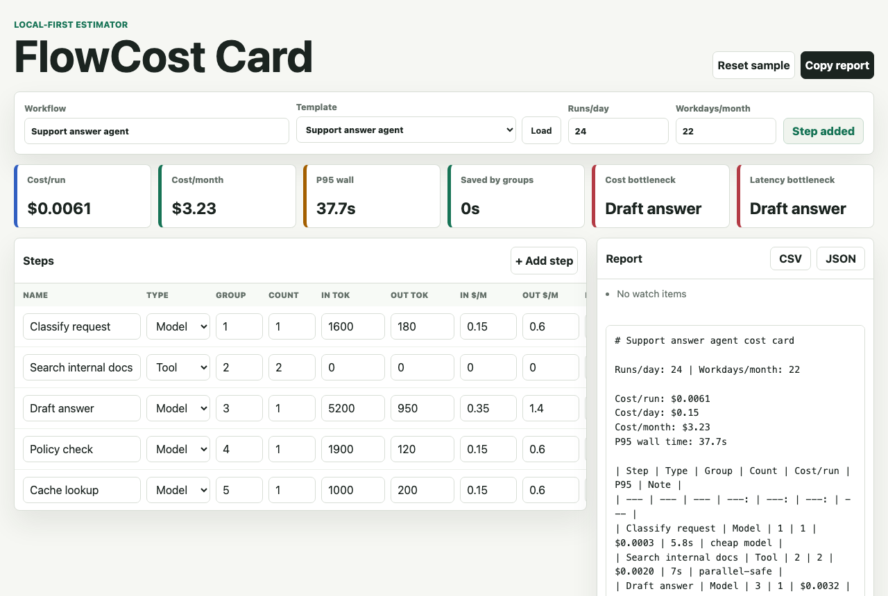

# FlowCost Card

[](https://bte808.github.io/fun-20260531-b-flow-cost-card/)


[](LICENSE)

FlowCost Card is a local-first AI workflow cost and latency forecaster. It helps turn a rough automation idea into a small run-rate card that can be copied into a planning note, README, issue, or launch checklist.

Live demo: <https://bte808.github.io/fun-20260531-b-flow-cost-card/>



## Project status

FlowCost Card is a small, maintained static tool at `0.1.1`. The current focus is keeping the calculation core understandable, expanding realistic workflow templates, and making the browser verification strict enough that mobile layout and report export regressions are caught before release.

Maintenance signals:

- MIT licensed.
- No runtime dependencies.
- Live GitHub Pages demo.
- Desktop and `390 x 844` mobile browser verification.
- Issue templates for bugs, calculation cases, and feature requests.
- CONTRIBUTING and SECURITY docs for external review.

## Why this exists

Small AI workflows often start cheap and fast, then become expensive or slow after retries, tool calls, higher traffic, or a few oversized prompts. FlowCost Card makes the hidden run-rate visible before you ship.

Inspiration came from public browsing on 2026-05-31:

- Product Hunt's productivity category, where recent launches keep emphasizing faster workflow decisions: <https://www.producthunt.com/categories/productivity>
- Hacker News Show HN, where small focused tools are easiest to evaluate quickly: <https://news.ycombinator.com/show>
- GitHub Trending, where local-first developer utilities remain easy to fork and reuse: <https://github.com/trending/javascript?since=daily>

Only the idea shape was borrowed. The code, UI, sample workflow, and wording in this repo are original.

## What it does

- Models each workflow step with count, token volume, token prices, fixed per-call cost, and P50/P95 latency.
- Loads starter templates for common small AI workflows.
- Groups steps that can run in parallel, then estimates wall-clock P50/P95 instead of only sequential time.
- Shows cost per run, per day, and per month.
- Points out the biggest cost and latency bottlenecks.
- Creates a Markdown report, CSV export, and JSON export.
- Keeps the current draft in `localStorage`; no account, API key, server, or tracking is required.

## Why it is useful

It is a quick planning tool for agent workflows, support automations, document processors, study helpers, internal ops tools, and any small flow where model calls, tools, or manual checks can quietly add up.

## Why it may be worth starring

- One page, one practical job.
- Runs as a static site and is easy to self-host on GitHub Pages.
- Uses user-entered rates instead of stale hard-coded model prices.
- Produces copy-ready output for teams that plan in issues, docs, or pull requests.
- The calculation core is isolated in `src/flow-cost-core.js`, so it is easy to fork.

## Demo workflow

The default sample estimates a support-answer agent:

| Step | Type | Group | Count | Cost idea | Latency idea |
| --- | --- | --- | ---: | --- | --- |
| Classify request | Model | 1 | 1 | small input/output token cost | cheap routing |
| Search internal docs | Tool | 2 | 2 | fixed per-call cost | can be cached |
| Draft answer | Model | 3 | 1 | largest token spend | main bottleneck |
| Policy check | Model | 4 | 1 | guardrail cost | final gate |

## Starter templates

The template picker includes synthetic starting points for:

- Support answer agent.
- Coding agent review loop.
- OCR document processor.
- Meeting notes summarizer.
- Study assistant.

Templates are intentionally small and sanitized. They are starting assumptions for planning, not vendor-specific price guidance.

## Run locally

```bash
npm test
npm run verify:browser
npm run serve
```

Then open:

```text
http://localhost:5179/
```

Because the app is static, any local static server works.

## Core usage

1. Name a workflow.
2. Enter expected runs per day and workdays per month.
3. Edit the step rows. Put steps in the same group when they can run in parallel.
4. Copy the Markdown report or export CSV/JSON.

## Verification

Local checks:

```bash
npm test
npm run verify:browser
npm run validate
git diff --check
```

`npm test` runs calculation tests and static wiring checks. `npm run verify:browser` starts a local server, opens temporary headless Chrome sessions, edits the tool at desktop and 390 x 844 mobile sizes, checks the report output, and fails on horizontal overflow.

To refresh the README screenshot:

```bash
SAVE_SCREENSHOT=docs/demo.png npm run verify:browser
```

## Contributing

Contributions are welcome when they keep the tool local-first, static, and easy to inspect. Good starter work includes adding realistic workflow templates, testing edge cases in the calculation core, tightening mobile layout, or improving the copy in generated Markdown cards.

See [CONTRIBUTING.md](CONTRIBUTING.md) for the local workflow and pull request checklist.

## Roadmap

- Add retry-rate fields per step.
- Add an import/export share URL for small plans.
- Add a cache-savings comparison mode.
- Add more calculation case tests from real planning notes.

## Security and privacy

FlowCost Card does not need an account, API key, backend service, analytics script, or hosted font. Drafts stay in browser `localStorage`, and exports are generated locally.

See [SECURITY.md](SECURITY.md) for reporting guidance and data-handling expectations.

## License

MIT
